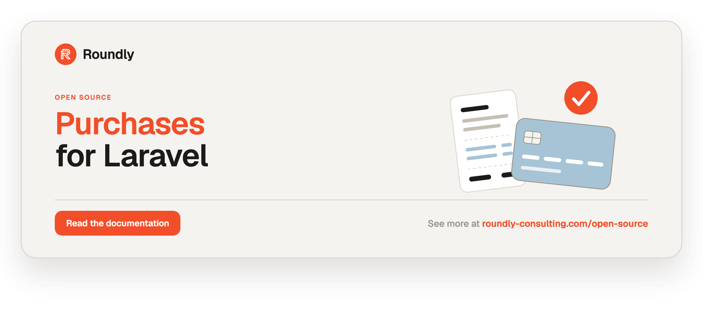

<!-- roundly-hero:start -->
<p align="center">
  <a href="https://roundly-consulting.com/open-source/docs/purchases-for-laravel?utm_source=github&utm_medium=readme&utm_campaign=open-source&utm_content=purchases-for-laravel">
    
  </a>
</p>
<!-- roundly-hero:end -->

<!-- roundly-badges:start -->
<p align="center">
  <a href="https://packagist.org/packages/roundly-consulting/purchases-for-laravel"></a>
  <a href="https://github.com/roundly-consulting/purchases-for-laravel/actions/workflows/run-tests.yml"></a>
  <a href="https://github.com/roundly-consulting/purchases-for-laravel/actions/workflows/fix-php-code-style-issues.yml"></a>
  <a href="https://donate.stripe.com/dRmeVe8FX5PF1Qd9pXcEw00"></a>
  <a href="https://www.patreon.com/cw/roundly"></a>
  <a href="https://roundly-consulting.com/support-us?utm_source=github&utm_medium=readme&utm_campaign=open-source&utm_content=purchases-for-laravel#crypto"></a>
</p>
<!-- roundly-badges:end -->

# Purchases for Laravel

A unified in-app-purchase and payments toolkit for Laravel: one API for **Apple App Store**,
**Google Play**, and **Stripe** purchases and subscriptions. The package ships Eloquent models
for purchases, purchase items, subscriptions, and subscription items, a pluggable provider
abstraction with a shared result contract, persistence actions, lifecycle events, and native
verification for every provider — built only on Laravel's HTTP client and our own
[`crypto-for-laravel`](https://github.com/roundly-consulting/crypto-for-laravel) and
[`money-for-laravel`](https://github.com/roundly-consulting/money-for-laravel)
(no `stripe/stripe-php`, no `google/apiclient`, no third-party SDKs).

## Requirements

- PHP 8.4+ with `ext-bcmath`
- Laravel 12 or 13

## Installation

```bash
composer require roundly-consulting/purchases-for-laravel
```

Publish and run the migrations. They are **publish-only** — the package never auto-loads
them, so a bare `php artisan migrate` will not create its tables until you publish:

```bash
php artisan vendor:publish --tag="purchases-migrations"
php artisan migrate
```

Optionally publish the config file (and, if you use the bundled webhook routes, the routes
file):

```bash
php artisan vendor:publish --tag="purchases-config"
php artisan vendor:publish --tag="purchases-routes"
```

Or run the install command, which publishes the config and migrations and offers to migrate:

```bash
php artisan purchases:install
```

## Configuration

The published `config/purchases.php` registers the models, the providers, the optional webhook
routes, and per-provider settings (all backed by env vars):

```php
return [
    'models' => [
        'purchase' => \RoundlyConsulting\Purchases\Models\Purchase::class,
        'purchase-item' => \RoundlyConsulting\Purchases\Models\PurchaseItem::class,
        'purchase-refund' => \RoundlyConsulting\Purchases\Models\PurchaseRefund::class,
        'purchase-notification' => \RoundlyConsulting\Purchases\Models\PurchaseNotification::class,
        'subscription' => \RoundlyConsulting\Purchases\Models\Subscription::class,
        'subscription-item' => \RoundlyConsulting\Purchases\Models\SubscriptionItem::class,
    ],

    'providers' => [
        \RoundlyConsulting\Purchases\Providers\Apple\Apple::class,
        \RoundlyConsulting\Purchases\Providers\Google\Google::class,
        \RoundlyConsulting\Purchases\Providers\Stripe\Stripe::class,
    ],

    // Log every verified raw payload to purchase_notifications before reducing it.
    'audit' => [
        'enabled' => env('PURCHASES_AUDIT_ENABLED', true),
    ],

    // Persist verified notifications on a queue; the webhook still 204s immediately.
    'queue' => [
        'enabled' => env('PURCHASES_QUEUE_ENABLED', false),
        'connection' => env('PURCHASES_QUEUE_CONNECTION'),
        'queue' => env('PURCHASES_QUEUE_NAME'),
    ],

    'routes' => [
        'enabled' => env('PURCHASES_ROUTES_ENABLED', false),
        'prefix' => env('PURCHASES_ROUTES_PREFIX', 'purchases'),
        'middleware' => ['api'],
    ],

    'settings' => [
        'apple' => [ /* sandbox, verifyReceipt urls, password, api { … } */ ],
        'google' => [ /* package_name, service_account { … }, base_url, acknowledge */ ],
        'stripe' => [ /* secret, webhook_secret, api_version, base_url, tolerance */ ],
    ],
];
```

### Environment variables

| Variable | Backs |
|---|---|
| `PURCHASES_APPLE_SANDBOX` | Apple sandbox toggle |
| `PURCHASES_APPLE_LIVE_URL` / `PURCHASES_APPLE_SANDBOX_URL` | `verifyReceipt` base URLs |
| `PURCHASES_APPLE_PASSWORD` | Apple shared secret (legacy receipt validation) |
| `PURCHASES_APPLE_CERTIFICATE_CLOCK_SKEW` | Clock-skew tolerance in **seconds** (0–3600, default `60`) for Apple's certificate validity check |
| `PURCHASES_APPLE_KEY_ID` / `PURCHASES_APPLE_ISSUER_ID` / `PURCHASES_APPLE_BUNDLE_ID` / `PURCHASES_APPLE_PRIVATE_KEY` | App Store Server API credentials |
| `PURCHASES_GOOGLE_PACKAGE_NAME` | Android package name |
| `PURCHASES_GOOGLE_CLIENT_EMAIL` / `PURCHASES_GOOGLE_PRIVATE_KEY` | Google service-account credentials |
| `PURCHASES_GOOGLE_TOKEN_URI` | Google OAuth2 token endpoint |
| `PURCHASES_GOOGLE_ACKNOWLEDGE` | Auto-acknowledge purchases (default `true`) |
| `PURCHASES_GOOGLE_PUSH_AUDIENCE` / `PURCHASES_GOOGLE_PUSH_SERVICE_ACCOUNT` | Pub/Sub push OIDC authentication: the push subscription's audience and service account |
| `PURCHASES_GOOGLE_PUSH_TOKEN` | Optional shared secret expected as `?token=` on the push endpoint URL |
| `PURCHASES_GOOGLE_PUSH_AUTHENTICATE` | Authenticate Pub/Sub pushes (default `true`, fail-closed); `false` only behind an upstream authenticator |
| `PURCHASES_GOOGLE_PUSH_JWKS_URL` / `PURCHASES_GOOGLE_PUSH_JWKS_CACHE_TTL` | Google's signing keys (default `https://www.googleapis.com/oauth2/v3/certs`, cached `3600` s) |
| `PURCHASES_STRIPE_SECRET` | Stripe secret/restricted key |
| `PURCHASES_STRIPE_WEBHOOK_SECRET` | Stripe webhook signing secret |
| `PURCHASES_STRIPE_API_VERSION` | Pinned Stripe API version |
| `PURCHASES_STRIPE_TOLERANCE` | Webhook timestamp tolerance (seconds) |
| `PURCHASES_ROUTES_ENABLED` / `PURCHASES_ROUTES_PREFIX` | Bundled webhook routes |
| `PURCHASES_AUDIT_ENABLED` | Log verified payloads to `purchase_notifications` (default `true`) |
| `PURCHASES_QUEUE_ENABLED` | Persist verified notifications on a queue (default `false`) |
| `PURCHASES_QUEUE_CONNECTION` / `PURCHASES_QUEUE_NAME` | Queue connection / queue for async recording |

> Provider secrets are read only from config/env and are marked `#[SensitiveParameter]` so they
> never leak into stack traces. They are never logged.

## Usage

### The `Purchases` facade

The fastest path is the `Purchases` facade. `result()` verifies and decodes a request into a
provider-agnostic `ProviderResult`; `handle()` does the same and **persists** it (records the
model and dispatches events).

```php
use RoundlyConsulting\Purchases\Facades\Purchases;

$result = Purchases::result('stripe', $request);   // verify + decode, no writes
$result->type();        // ResultType::Subscription
$result->status();      // Status enum
$result->providerId();  // provider-side id

$model = Purchases::handle('stripe', $request);     // verify + decode + persist + events

Purchases::provider('google');   // Provider (throws UnknownProviderException if absent)
Purchases::has('apple');         // bool
Purchases::ids();                // ['apple', 'google', 'stripe']
```

### The unified result contract

Every provider maps its native payload onto `RoundlyConsulting\Purchases\Contracts\ProviderResult`,
so host code is provider-agnostic: `provider()`, `type()`, `providerId()`, `transactionId()`,
`status()`, `name()`, `productId()`, `price()`, `activeFrom()`, `trialEndsAt()`, `endsAt()`,
`items()`, `refundReason()`, `isChargeback()`, and `raw()` (the original decoded payload).

`Status` now also exposes the billing-retry states `Status::InGracePeriod`, `Status::OnHold`,
and `Status::Refunded` (all additive), plus `Status::isActive()` which is true for `Completed`
and `InGracePeriod`. `ResultType::Refund` covers refunds and chargebacks.

### Events

`Purchases::handle()` (and the persistence actions) dispatch package events you can listen for:
`PurchaseRecorded`, `PurchaseCompleted`, `PurchaseFailed`, `PurchaseRefunded`,
`ChargebackReceived`, `SubscriptionStarted`, `SubscriptionRenewed`, `SubscriptionCanceled`,
`SubscriptionExpired`, and `SubscriptionInGracePeriod` — each carrying the persisted model and
the originating `ProviderResult`. Every store may deliver a notification more than once, so these
fire only when something changed (a new row, a status that moved, a renewal that extended
`ends_at`, a new refunded amount) — a repeated delivery never fulfils an order twice.
`PurchaseRecorded` fires for every recorded purchase result.

Informational notifications change nothing: an Apple renewal-preference or auto-renew change,
price increase, consumption request, declined refund or TEST, a Google deferral or price-change
update, and any event type a provider does not map are audited but never applied — they cannot
overwrite a subscription's status or fire `SubscriptionExpired`. `handle()` then returns the audit
`PurchaseNotification`.

### Refunds & chargebacks

Apple `REFUND`/`REVOKE`, Google `*_REVOKED` / voided-purchase RTDNs, and Stripe
`charge.refunded` / `charge.dispute.*` events decode into a first-class `PurchaseRefund` model.
`handle()` records the refund, links it to the originating purchase, flips that purchase to
`Status::Refunded`, and dispatches `PurchaseRefunded` (or `ChargebackReceived` for disputes). A
refunded or revoked Apple subscription period and a revoked Google subscription also flip the
`Subscription` to `Refunded`, so it stops being active; an Apple refund's `refunded_at` is its
`revocationDate`. A **partial** refund (a Stripe charge not fully `refunded`, a Google
quantity-based partial void) is recorded and fires `PurchaseRefunded`, but leaves the purchase
completed.

```php
$purchase->refunds;                 // HasMany<PurchaseRefund>
PurchaseRefund::chargebacks()->get();
```

### Async webhook processing

Set `PURCHASES_QUEUE_ENABLED=true` to verify webhooks synchronously but persist on a queue. The
webhook controller still returns `204` immediately; a `ProcessProviderNotification` job records
the result on the configured connection/queue. The synchronous path is the default.

### Raw notification audit log

When `PURCHASES_AUDIT_ENABLED=true` (the default), every verified notification is stored in
`purchase_notifications` (provider, type, signature-verified flag, payload snapshot,
`processed_at`) before it is reduced to model state.

```bash
# Re-run stored notifications through the recording pipeline.
php artisan purchases:replay {id?} --provider=stripe --since=2026-01-01
```

### Subscription scopes & helpers

```php
Subscription::active()->expiring(7)->get();
Subscription::trialing()->get();
Subscription::canceled()->get();

$subscription->isActive();
$subscription->onTrial();
$subscription->daysUntilRenewal();   // ?int
$subscription->isExpiring(7);
```

Provider/identifier scopes are available on `Purchase`, `Subscription`, and `PurchaseRefund`:
`forProvider('stripe')`, `byProviderId($id)`, `byTransaction($txId)`.

### The `HasPurchases` trait

Add the trait to your owner model (typically `User`) for convenient access through the package's
`owner` morph:

```php
use RoundlyConsulting\Purchases\Concerns\HasPurchases;

class User extends Authenticatable
{
    use HasPurchases;
}

$user->purchases;                    // MorphMany<Purchase>
$user->subscriptions;                // MorphMany<Subscription>
$user->activeSubscription('pro');    // ?Subscription
$user->subscribedTo('pro');          // bool
```

### Models and money

`Purchase`, `PurchaseItem`, `Subscription`, `SubscriptionItem`, `PurchaseRefund`, and
`PurchaseNotification` (under `RoundlyConsulting\Purchases\Models`) are standard Eloquent models
with soft deletes and factories. Every model is swappable via `config('purchases.models.*')`.

The `price` attribute on the five priced models is a
[`money-for-laravel`](https://github.com/roundly-consulting/money-for-laravel) `Money`, cast with
`AsMoney` over two columns: `price` (`decimal(38,0)` minor units) and `price_currency` (ISO
code). Amounts are arbitrary-precision strings, so there is no 32- or 64-bit ceiling on
PostgreSQL or MySQL, and JPY/BHD use their real exponents.

```php
use RoundlyConsulting\Money\Money;

$purchase->price = Money::ofMinor(2599, 'USD');   // writes price + price_currency
$purchase->price->minor();                         // "2599" (string)
$purchase->price->currency()->code;                // "USD"
$purchase->price->toDecimal();                     // "25.99"
$purchase->price->add(Money::ofMinor(100, 'USD')); // 26.99 USD
$purchase->price->format('en_US');                 // "$25.99"

$purchase->price = null;                           // clears the amount, keeps price_currency
```

The cast is strict: assigning a raw integer throws `InvalidMoneyValue` (a bare number has no
currency), and an amount stored with a null `price_currency` throws on read.

**Store prices.** Stripe amounts are read in Stripe's smallest currency unit and re-scaled for the
currencies where Stripe differs from ISO 4217 (ISK and UGX are sent with two decimals, MGA with
none) — see `Providers\Stripe\StripeAmount::SCALE_EXCEPTIONS`. A float or `"12.5"` amount is
refused, never truncated. Apple notifications carry the transaction's `price` in milli-units,
rounded half away from zero to the currency's minor unit; a refund records what was refunded (a
prorated refund's `revocationPercentage` share, rounded once), and a Family Sharing `REVOKE`
records no amount. Google subscriptionsv2 purchases report
the sum of their line items' `autoRenewingPlan.recurringPrice` (prepaid plans carry none). Google
one-time product purchases carry no price in the Play Developer API, so their `price()` stays
`null`.

Stored notification snapshots keep the price as
`{"minor": "1999", "decimal": "19.99", "currency": "USD"}`; a snapshot whose price money refuses is
skipped by `purchases:replay`.

### Apple

```php
use RoundlyConsulting\Purchases\Providers\Apple\Apple;
use RoundlyConsulting\Purchases\Providers\Apple\AppStoreServerApi;

// Verify a signed App Store server notification (ES256 JWS, native).
$payload = app(Apple::class)->notification($request);

// Modern App Store Server API (preferred over the deprecated verifyReceipt path).
$transaction = app(AppStoreServerApi::class)->transaction('2000000000000001');
$transaction->productId;
```

`Apple::callback()` still calls Apple's deprecated `verifyReceipt` endpoint for legacy receipts.

### Google Play

Verifies one-time products and **subscriptionsv2** purchases against the Play Developer API,
authenticating with a service account via a native OAuth2 JWT-bearer grant. Real-time Developer
Notifications (delivered through Pub/Sub) decode into a typed `DeveloperNotification`.

```php
use RoundlyConsulting\Purchases\Providers\Google\Google;

$google = app(Google::class);
$google->product('coins.100', $purchaseToken);   // ProductPurchase
$google->subscription($purchaseToken);           // SubscriptionPurchase (acknowledged by default)
$google->notification($request);                 // DeveloperNotification (RTDN)
```

Auto-acknowledgement is on by default; set `PURCHASES_GOOGLE_ACKNOWLEDGE=false` to opt out.

**Authenticating RTDN pushes.** A Pub/Sub push is a plain HTTPS POST that anyone could forge, so
`notification()` (and therefore the webhook route) authenticates every push first and is
**fail-closed** — with nothing configured, every push is rejected (`400` on the route):

1. In Google Cloud, edit the push subscription → *Enable authentication*, pick a service account
   and set the audience (e.g. your endpoint URL).
2. Set the same two values:

```dotenv
PURCHASES_GOOGLE_PUSH_AUDIENCE=https://app.test/purchases/webhooks/google
PURCHASES_GOOGLE_PUSH_SERVICE_ACCOUNT=rtdn-push@my-project.iam.gserviceaccount.com
```

Each push's `Authorization: Bearer` OIDC token is then verified with crypto-for-laravel: the RS256
signature against Google's JWKS (fetched and cached; re-fetched for a rotated key at most once a
minute), the issuer (`accounts.google.com`), audience, service-account `email`, `email_verified`
and expiry. Optionally (alone or on top), append a secret to the push URL
(`…/webhooks/google?token=<secret>`) and set `PURCHASES_GOOGLE_PUSH_TOKEN=<secret>`; it is compared
in constant time. If your own pull subscriber hands messages to `Purchases::handle()`, set
`PURCHASES_GOOGLE_PUSH_AUTHENTICATE=false` — only when something upstream already authenticated
them.

### Stripe

Verifies webhook signatures natively (HMAC-SHA256 over `t.payload`, constant-time comparison,
configurable timestamp tolerance) and reads REST objects with the pinned API version.

One-off payments (`payment_intent.*`, a payment-mode `checkout.session.completed` — keyed on its
PaymentIntent so both describe one purchase — and one-off invoices) are recorded as purchases.
Subscription billing is not: a subscription- or setup-mode Checkout, a subscription invoice and the
PaymentIntent behind it are audited only, and the subscription's own `customer.subscription.*`
events keep its state.

A dispute is a chargeback only while the funds are gone: an inquiry (`warning_*`) and
`charge.dispute.updated` change nothing, a dispute closed as **won** reinstates the purchase
(`PurchaseCompleted`), and a **lost** one stays the single chargeback recorded at
`charge.dispute.created` (keyed on the dispute id).

```php
use RoundlyConsulting\Purchases\Providers\Stripe\Stripe;

$stripe = app(Stripe::class);
$event = $stripe->notification($request);        // verifies signature, returns StripeEvent
$stripe->paymentIntent('pi_123');                // PaymentIntent
$stripe->subscription('sub_123');                // Subscription
$stripe->session('cs_123');                      // CheckoutSession
$stripe->invoice('in_123');                      // Invoice
```

### Optional webhook routes

Disabled by default. Set `PURCHASES_ROUTES_ENABLED=true` to register
`POST /{prefix}/webhooks/{provider}`, which verifies, persists, fires events, and returns `204`
(invalid signature or an unauthenticated Google push → `400`, unknown provider → `404`).

### Commands

- `php artisan purchases:install` — publish config + migrations (and optionally migrate). Pass
  `--providers` to interactively choose providers and append their `.env` keys.
- `php artisan purchases:providers` — list configured providers and flag missing config.
- `php artisan purchases:verify {provider?}` — actively hit each provider (token exchange / a
  cheap authed call) and report whether the credentials genuinely work. Fails gracefully per
  provider.
- `php artisan purchases:replay {id?} --provider= --since=` — re-run stored audit notifications
  through the recording pipeline.

### Exceptions

All package exceptions extend `RoundlyConsulting\Purchases\Exceptions\Exception` with a
`because()` factory: `VerificationException`, `InvalidProviderNotificationException`, and
`UnknownProviderException`. Money errors come from money-for-laravel (all extend
`RoundlyConsulting\Money\Exceptions\MoneyException`).

### Testing helpers

`Purchases::fake()` swaps the manager for a `Bus::fake()`-style double that records handled
notifications and exposes assertions, without performing real verification. `FakeResult` and
`PayloadFactory` (under `RoundlyConsulting\Purchases\Testing`) build fake results and raw
provider payloads.

```php
use RoundlyConsulting\Purchases\Facades\Purchases;
use RoundlyConsulting\Purchases\Testing\FakeResult;

$fake = Purchases::fake();
$fake->push('stripe', FakeResult::subscription('stripe', 'sub_1'));

Purchases::handle('stripe', $request);

$fake->assertHandled('stripe');
$fake->assertSubscriptionStarted('stripe');
// also: assertPurchaseRecorded(), assertRefundRecorded(), assertHandledCount(), assertNothingHandled()
```

## Integrates with

### crypto-for-laravel (required)

Every cryptographic primitive purchases needs comes from
[`crypto-for-laravel`](https://github.com/roundly-consulting/crypto-for-laravel) — the package
hand-rolls no algorithm of its own:

| Provider | What crypto does | What purchases keeps |
|---|---|---|
| **Stripe** | HMAC-SHA256 (`Hash\Hmac`) + constant-time compare (`Hash\ConstantTime`) | the `t=`/`v1=` scheme framing and the replay-tolerance window |
| **Apple** | ES256 JWS verify + sign (`Jose\Jws`, `Signature\Es`, `Signature\Key\EcKey`), plus all X.509 mathematics — parsing, SHA-1 fingerprints, chain linkage and validity dates (`X509\Chain`, `X509\Certificate`) | **the certificate-chain trust decision** — the `x5c` chain is pinned to Apple's published WWDR intermediate and G3 root by fingerprint, each link is proven to have signed the one below it, and every certificate must be inside its validity window |
| **Google** | RS256 JWS assertion (`Jose\Jws`, `Signature\Rs`, `Signature\Key\RsaKey`) | the JWT-bearer grant, scope, and token caching |

The split is deliberate: **crypto owns algorithms, purchases owns trust**. Apple's pinned
fingerprints are what stop a forged App Store notification, so they stay here, next to the
notification handling they protect. Purchases calls no `openssl_*` function of its own.

#### Apple certificate validity (and the clock-skew leeway)

An App Store notification is rejected when **any** certificate in its `x5c` chain — leaf,
intermediate, or root — is outside its `notBefore..notAfter` window. The check has a
configurable clock-skew tolerance, applied to **both** ends of the window, so a host whose
clock runs slightly fast or slow does not spuriously reject genuine notifications:

```php
// config/purchases.php
'settings' => [
    'apple' => [
        // Seconds, 0–3600. Default 60. Anything outside that range is a
        // misconfiguration and throws InvalidConfigurationException — a
        // fat-fingered value can never silently switch the check off.
        'certificate_clock_skew' => env('PURCHASES_APPLE_CERTIFICATE_CLOCK_SKEW', 60),
    ],
],
```

The rejection has its own message (naming the certificate and the instant it lapsed), so an
expired chain is never mistaken for a bad signature:

```
RoundlyConsulting\Purchases\Exceptions\VerificationException:
Apple certificate [Apple Worldwide Developer Relations Certification Authority] expired at
2026-01-01T00:00:00+00:00; the notification's certificate chain is outside its validity period.
```

> **Expired certificates are rejected.** A **replayed or archived** notification signed by a
> since-rotated, expired certificate is **rejected** — a valid signature alone is not enough. If
> you replay historical Apple payloads, expect them to fail once their signing certificate has
> lapsed — that is the correct outcome. Raise
> `certificate_clock_skew` only to absorb clock drift; it is not a grace period and is capped
> at one hour.

Crypto is zero-config — purchases builds every signer and verifier from its **own**
`config/purchases.php` (Apple key/issuer/kid, Google service-account credentials, Stripe webhook
secret). It needs no extra env keys and nothing extra to publish.

### enums-for-laravel (required)

Purchases builds on [`enums-for-laravel`](https://github.com/roundly-consulting/enums-for-laravel).
The domain enums `Enum\Status` and `Enum\ResultType` use its `Helpers` trait, so they expose
select-option and validation ergonomics without any bespoke arrays or language files:

```php
use RoundlyConsulting\Purchases\Enum\Status;

Status::options();          // list of {value, label, name} option DTOs for select inputs
Status::toOptions();        // ['completed' => 'Completed', 'in_grace' => 'In Grace', …]
Status::labels();           // human strings incl. "In Grace" / "On Hold" (no lang files)
Status::validationRule();   // "in:new,pending,processing,completed,failed,canceled,in_grace,on_hold,refunded"

$status = Status::tryFromLabel('On Hold');   // Status::OnHold
$status?->isActive();                        // domain entitlement check is unchanged
```

`Enum\ResultType` gains the same surface (`options()`, `toOptions()`, `validationRule()`, case
lookups). The ~20 Apple/Google/Stripe provider enums deliberately stay bare — they mirror external
wire contracts and are mapped internally, never surfaced as user-choosable option sets.

### money-for-laravel (required)

Purchases builds on [`money-for-laravel`](https://github.com/roundly-consulting/money-for-laravel)
for every price:

- **One Money type** — `ProviderResult::price()`, `ResultItem`, the `Record*Data` DTOs, the Stripe
  value objects and the models all speak `RoundlyConsulting\Money\Money`.
- **`AsMoney` cast + `$table->money('price', nullable: true)`** on the five priced tables.
- **Exact store conversions** — `Money::ofMinor` for Stripe (plus its documented scale
  exceptions), `Money::ofScaled` for Apple milli-units and Google `units`/`nanos`.
- **A stable snapshot shape** — audit notifications store `Money::toArray()` and replay through
  `Money::fromArray()`.

Money needs no configuration here; its own `config/money.php` (precision, formatter, exchange
rates) applies. Revenue across currencies (`MoneyBag::total()`) is available to host code today.

### Host recipes (no dependency added)

These integrations are wired in the host app, not pulled in as requires:

- **shops payment driver** — implement `shops`' payment-driver contract in your app backed by a
  purchases provider (Stripe/Apple/Google). Same-tier, so it stays a host recipe rather than a
  package dependency.
- **credits / campaigns / metrics** — listen to the purchase and refund events purchases dispatches
  and call `credits` (grant/claw-back), trigger `campaigns` post-purchase flows, or feed a `metrics`
  sink. Host wiring keeps purchases free of those packages.

## Testing

```bash
composer test
```

## Changelog

Please see [CHANGELOG](CHANGELOG.md) for more information on what has changed recently.

<!-- roundly-support:start -->
## Support our work

This package is free and open source, built and maintained by
[Roundly Consulting](https://roundly-consulting.com/open-source?utm_source=github&utm_medium=readme&utm_campaign=open-source&utm_content=purchases-for-laravel).
If it saves you time, please consider supporting our open-source work — a one-time donation, a
monthly pledge on Patreon or a crypto donation helps fund maintenance, new features and new
packages.

<a href="https://donate.stripe.com/dRmeVe8FX5PF1Qd9pXcEw00"></a>
<a href="https://www.patreon.com/cw/roundly"></a>
<a href="https://roundly-consulting.com/support-us?utm_source=github&utm_medium=readme&utm_campaign=open-source&utm_content=purchases-for-laravel#crypto"></a>
<!-- roundly-support:end -->

## License

The MIT License (MIT). Please see [License File](LICENSE.md) for more information.
